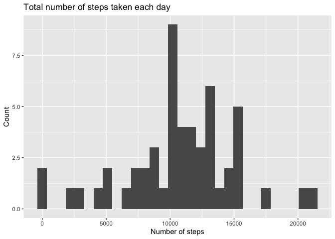
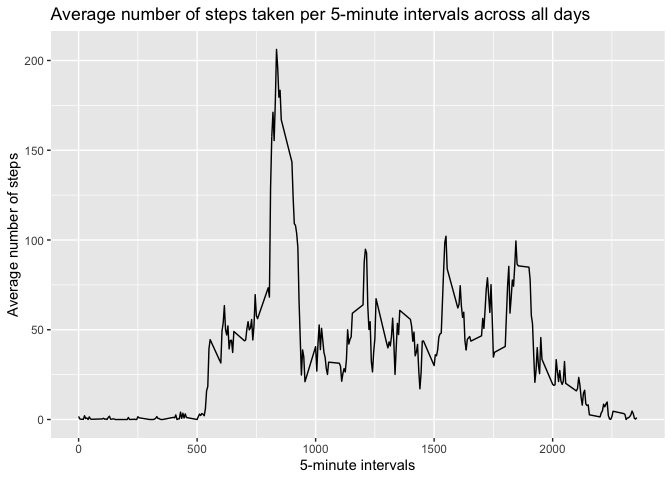
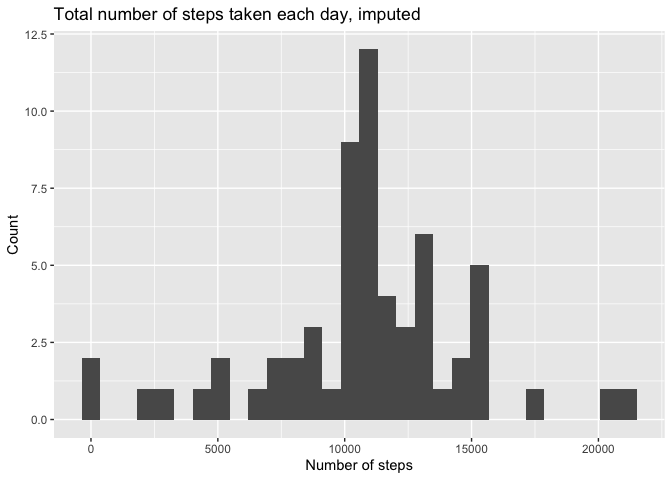
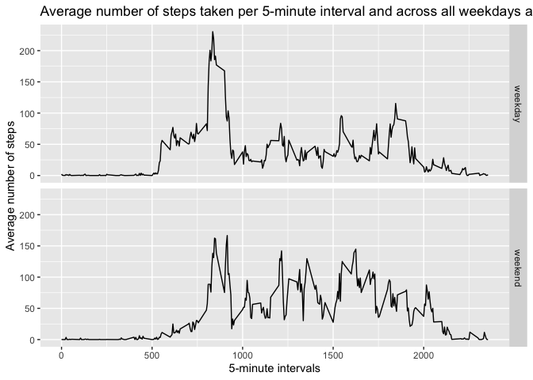

## Loading and preprocessing the data

The following code chunk loads the tidyverse package. It then checks if the file "activity.csv" is available in the workspace. If it isn't, it unzips "activity.zip". Afterwards, the database is loaded into a dataframe named "activity". Variables:

- filename: String, indicates the name of the .csv file that contains the database.
- activity: Dataframe (17568 x 3). Raw data.


```r
library(tidyverse)
```

```
## ── Attaching packages ───────────────────────────────────────────────────────────── tidyverse 1.2.1 ──
```

```
## ✔ ggplot2 3.2.0     ✔ purrr   0.3.2
## ✔ tibble  2.1.3     ✔ dplyr   0.8.3
## ✔ tidyr   0.8.3     ✔ stringr 1.4.0
## ✔ readr   1.3.1     ✔ forcats 0.4.0
```

```
## ── Conflicts ──────────────────────────────────────────────────────────────── tidyverse_conflicts() ──
## ✖ dplyr::filter() masks stats::filter()
## ✖ dplyr::lag()    masks stats::lag()
```

```r
filename <- "activity.csv"

if (!file.exists(filename)) {
        unzips("activity.zip")
}

activity <- read_csv(filename)
```

```
## Parsed with column specification:
## cols(
##   steps = col_double(),
##   date = col_date(format = ""),
##   interval = col_double()
## )
```

```r
str(activity)
```

```
## Classes 'spec_tbl_df', 'tbl_df', 'tbl' and 'data.frame':	17568 obs. of  3 variables:
##  $ steps   : num  NA NA NA NA NA NA NA NA NA NA ...
##  $ date    : Date, format: "2012-10-01" "2012-10-01" ...
##  $ interval: num  0 5 10 15 20 25 30 35 40 45 ...
##  - attr(*, "spec")=
##   .. cols(
##   ..   steps = col_double(),
##   ..   date = col_date(format = ""),
##   ..   interval = col_double()
##   .. )
```

```r
head(activity)
```

```
## # A tibble: 6 x 3
##   steps date       interval
##   <dbl> <date>        <dbl>
## 1    NA 2012-10-01        0
## 2    NA 2012-10-01        5
## 3    NA 2012-10-01       10
## 4    NA 2012-10-01       15
## 5    NA 2012-10-01       20
## 6    NA 2012-10-01       25
```

```r
tail(activity)
```

```
## # A tibble: 6 x 3
##   steps date       interval
##   <dbl> <date>        <dbl>
## 1    NA 2012-11-30     2330
## 2    NA 2012-11-30     2335
## 3    NA 2012-11-30     2340
## 4    NA 2012-11-30     2345
## 5    NA 2012-11-30     2350
## 6    NA 2012-11-30     2355
```

## What is mean total number of steps taken per day?

The following code chunk calculates the total number of steps per day, plots them in a histogram and then calculates their mean and median.

- stepsperday: Dataframe (61 x 2). Total number of steps taken per day
- meansteps: Numeric. Mean of total number of steps taken per day
- mediansteps: Numeric. Median of total number of steps taken per day


```r
stepsperday <- activity %>% 
        filter(!is.na(steps)) %>%
        group_by(date) %>% 
        summarize(totalsteps = sum(steps))
str(stepsperday)
```

```
## Classes 'tbl_df', 'tbl' and 'data.frame':	53 obs. of  2 variables:
##  $ date      : Date, format: "2012-10-02" "2012-10-03" ...
##  $ totalsteps: num  126 11352 12116 13294 15420 ...
##  - attr(*, "spec")=
##   .. cols(
##   ..   steps = col_double(),
##   ..   date = col_date(format = ""),
##   ..   interval = col_double()
##   .. )
```

```r
head(stepsperday)
```

```
## # A tibble: 6 x 2
##   date       totalsteps
##   <date>          <dbl>
## 1 2012-10-02        126
## 2 2012-10-03      11352
## 3 2012-10-04      12116
## 4 2012-10-05      13294
## 5 2012-10-06      15420
## 6 2012-10-07      11015
```

```r
tail(stepsperday)
```

```
## # A tibble: 6 x 2
##   date       totalsteps
##   <date>          <dbl>
## 1 2012-11-24      14478
## 2 2012-11-25      11834
## 3 2012-11-26      11162
## 4 2012-11-27      13646
## 5 2012-11-28      10183
## 6 2012-11-29       7047
```

```r
stepsperday %>% 
        ggplot(aes(x = totalsteps)) + 
        geom_histogram() + 
        labs(x = "Number of steps", y = "Count", title = "Total number of steps taken each day")
```

```
## `stat_bin()` using `bins = 30`. Pick better value with `binwidth`.
```

<!-- -->

```r
meansteps <- with(stepsperday, mean(totalsteps))
meansteps
```

```
## [1] 10766.19
```

```r
mediansteps <- with(stepsperday, median(totalsteps))
mediansteps
```

```
## [1] 10765
```

The mean and median of the total number of steps taken per day are 1.0766189\times 10^{4} and 1.0765\times 10^{4}, respectively.

## What is the average daily activity pattern?

The following code calculates the average number of steps taken per 5-minute intervals across days of observation, plots them in a time-series plot, and prints the 5-minute interval with the maximum number of average steps.
- stepsperinterval: Dataframe(288 x 2). Average number of steps per 5-minute intervals across all days
- maxinterval: Numeric. 5-minute interval with the maximum number of average steps across all days.


```r
stepsperinterval <- activity %>% 
        filter(!is.na(steps)) %>%
        group_by(interval) %>% 
        summarize(averagestepsperinterval = mean(steps, na.rm = TRUE))
str(stepsperinterval)
```

```
## Classes 'tbl_df', 'tbl' and 'data.frame':	288 obs. of  2 variables:
##  $ interval               : num  0 5 10 15 20 25 30 35 40 45 ...
##  $ averagestepsperinterval: num  1.717 0.3396 0.1321 0.1509 0.0755 ...
##  - attr(*, "spec")=
##   .. cols(
##   ..   steps = col_double(),
##   ..   date = col_date(format = ""),
##   ..   interval = col_double()
##   .. )
```

```r
head(stepsperinterval)
```

```
## # A tibble: 6 x 2
##   interval averagestepsperinterval
##      <dbl>                   <dbl>
## 1        0                  1.72  
## 2        5                  0.340 
## 3       10                  0.132 
## 4       15                  0.151 
## 5       20                  0.0755
## 6       25                  2.09
```

```r
tail(stepsperinterval)
```

```
## # A tibble: 6 x 2
##   interval averagestepsperinterval
##      <dbl>                   <dbl>
## 1     2330                   2.60 
## 2     2335                   4.70 
## 3     2340                   3.30 
## 4     2345                   0.642
## 5     2350                   0.226
## 6     2355                   1.08
```

```r
stepsperinterval %>%
        ggplot(aes(x = interval, y = averagestepsperinterval)) +
        geom_line() +
        labs(x = "5-minute intervals", y = "Average number of steps", title = "Average number of steps taken per 5-minute intervals across all days")
```

<!-- -->

```r
maxinterval <- stepsperinterval[which.max(stepsperinterval$averagestepsperinterval), ][, 1]
maxinterval
```

```
## # A tibble: 1 x 1
##   interval
##      <dbl>
## 1      835
```

The 5-minute interval that contains the maximum number of steps on average across all days is the 835 interval.

## Imputing missing values

The following code calculates the total number of NAs in the dataset, imputes the missing values with their corresponding 5-interval mean across all days, creates a new dataset "activity_imputed" with the imputed data, plots a histogram the total number of steps taken each day in "activity_imputed", and prints their mean and median.

- totalNA: Integer. Total number of NAs in the dataset.
- activity_imputed: Dataframe (17568 x 3). Dataframe with missing values imputed as their corresponding 5-minute interval averages.
- stepsperday_imputed: Dataframe (61 x 2). Total number of steps taken per day in the imputed dataset.
- meansteps_imputed: Numeric. Mean of the total number of steps taken per day in the imputed dataset.
- mediansteps_imputed: Numeric. Median of the total number of steps taken per day in the imputed dataset.


```r
totalNA <- sum(is.na(activity))
totalNA
```

```
## [1] 2304
```

```r
activity_imputed <- activity
missing <- is.na(activity_imputed$steps)
meaninterval <- tapply(activity_imputed$steps, activity_imputed$interval, mean, na.rm = TRUE, simplify = TRUE)
activity_imputed$steps[missing] <- meaninterval[as.character(activity_imputed$interval[missing])]
str(activity_imputed)
```

```
## Classes 'spec_tbl_df', 'tbl_df', 'tbl' and 'data.frame':	17568 obs. of  3 variables:
##  $ steps   : num  1.717 0.3396 0.1321 0.1509 0.0755 ...
##  $ date    : Date, format: "2012-10-01" "2012-10-01" ...
##  $ interval: num  0 5 10 15 20 25 30 35 40 45 ...
##  - attr(*, "spec")=
##   .. cols(
##   ..   steps = col_double(),
##   ..   date = col_date(format = ""),
##   ..   interval = col_double()
##   .. )
```

```r
head(activity_imputed)
```

```
## # A tibble: 6 x 3
##    steps date       interval
##    <dbl> <date>        <dbl>
## 1 1.72   2012-10-01        0
## 2 0.340  2012-10-01        5
## 3 0.132  2012-10-01       10
## 4 0.151  2012-10-01       15
## 5 0.0755 2012-10-01       20
## 6 2.09   2012-10-01       25
```

```r
tail(activity_imputed)
```

```
## # A tibble: 6 x 3
##   steps date       interval
##   <dbl> <date>        <dbl>
## 1 2.60  2012-11-30     2330
## 2 4.70  2012-11-30     2335
## 3 3.30  2012-11-30     2340
## 4 0.642 2012-11-30     2345
## 5 0.226 2012-11-30     2350
## 6 1.08  2012-11-30     2355
```

```r
stepsperday_imputed <- activity_imputed %>%
        group_by(date) %>%
        summarize(totalsteps = sum(steps))

stepsperday_imputed %>%
        ggplot(aes(x = totalsteps)) + 
        geom_histogram() + 
        labs(x = "Number of steps", y = "Count", title = "Total number of steps taken each day, imputed")
```

```
## `stat_bin()` using `bins = 30`. Pick better value with `binwidth`.
```

<!-- -->

```r
meansteps_imputed <- with(stepsperday_imputed, mean(totalsteps))
meansteps_imputed
```

```
## [1] 10766.19
```

```r
mediansteps_imputed <- with(stepsperday_imputed, median(totalsteps))
mediansteps_imputed
```

```
## [1] 10766.19
```

There are 2304 NAs in the dataset. The mean and median of the total number of steps taken each day after imputation are 1.0766189\times 10^{4} and 1.0766189\times 10^{4}, respectively. The impact of imputing missing data is almost negligible in terms of changes of the mean and median.

## Are there differences in activity patterns between weekdays and weekends?

The following code creates a new factor variable in the imputed dataset called "week_end"
- activity_imputed: Dataframe (17568 x 4). Imputed dataset with a new factor "week_end" factor variable.

```r
activity_imputed <- activity_imputed %>%
        mutate(week_end = ifelse(weekdays(date) == "Saturday" | weekdays(date) == "Sunday", "weekend", "weekday"))
activity_imputed$week_end <- as.factor(activity_imputed$week_end)

activity_imputed %>%
        group_by(interval, week_end) %>%
        summarize(totalsteps = mean(steps)) %>%
        ggplot(aes(x = interval, y = totalsteps)) +
        geom_line() + 
        facet_grid(rows = vars(week_end)) +
        labs(x = "5-minute intervals", y = "Average number of steps", title = "Average number of steps taken per 5-minute interval and across all weekdays and weekends")
```

<!-- -->

